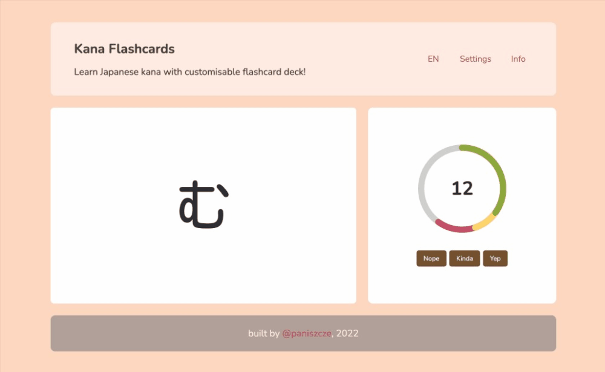

# Kana Flashcards

Learn Japanese kana with customisable flashcard deck.

## About

Kana Flashcards is a single page application built with React. The app was developped with intent to help Japanese language learners to memorise basic Japanese syllabaries: hiragana and katakana.

On each learning session user is presented with a sequence of randomly chosen flashcards containing a kana character on one side and its romanised transcription on the other. After having inspected one flashcard, user can assess the extent to which they're familiar with a given character and move on to the next one. Once all the flashcards planned for the session have been evaluated, user is presented with overall results and a possibility to start yet another round. Yay!

App behaviour can be modified to fully adapt to learner's knowledge level and preferences thanks to highly customisable flashcard deck. The responsive design of the app facilitates learning kana on mobile devices as well. Double yay!

Have fun!

がんばってよ!

---

### TODOs

#### Rework:
- centralise application state (Redux / React hooks)
- rewrite logic of handling buttons in Settings or refactor into smaller functions
- display answer count in Results modal outside colored bar if it doesn't fit in

#### Bugs:
- card change when saving Settings should happen once the dictionary has been updated
- hide language toggle when clicking outside dropdown div

#### New features:
- add logic to minimise card repetition
- track the answers to show the least known kana in Results
- write down general instructions in Info
- add basic keyboard navigation
